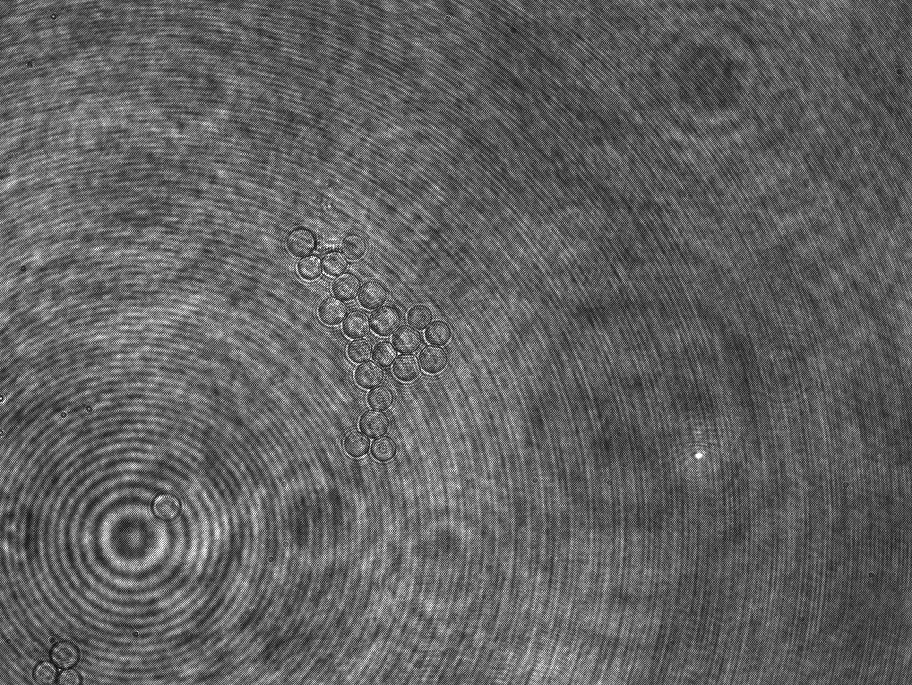
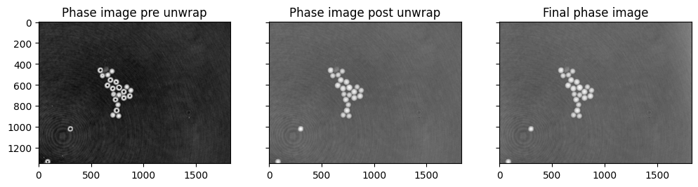

# off-axis-holography-python

## Description

Simple example of holographic reconstruction of an image aquired via off-axis-holography and also how to propagate the field

### Dependencies
numpy
matplotlib
scikit-image
scipy

### Examples
####Holographic reconstruction
Start from a holographic image and go to the full optical field.

and go to  

