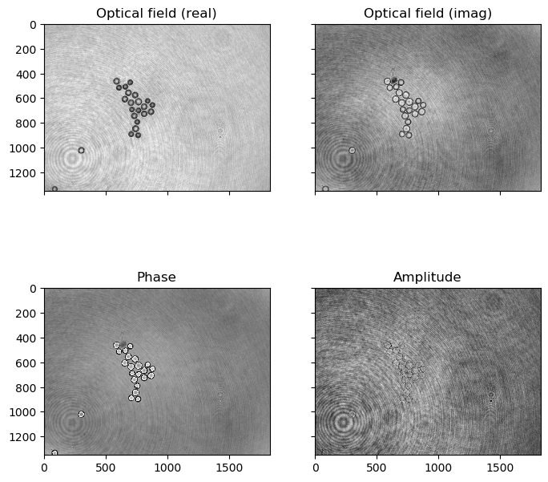
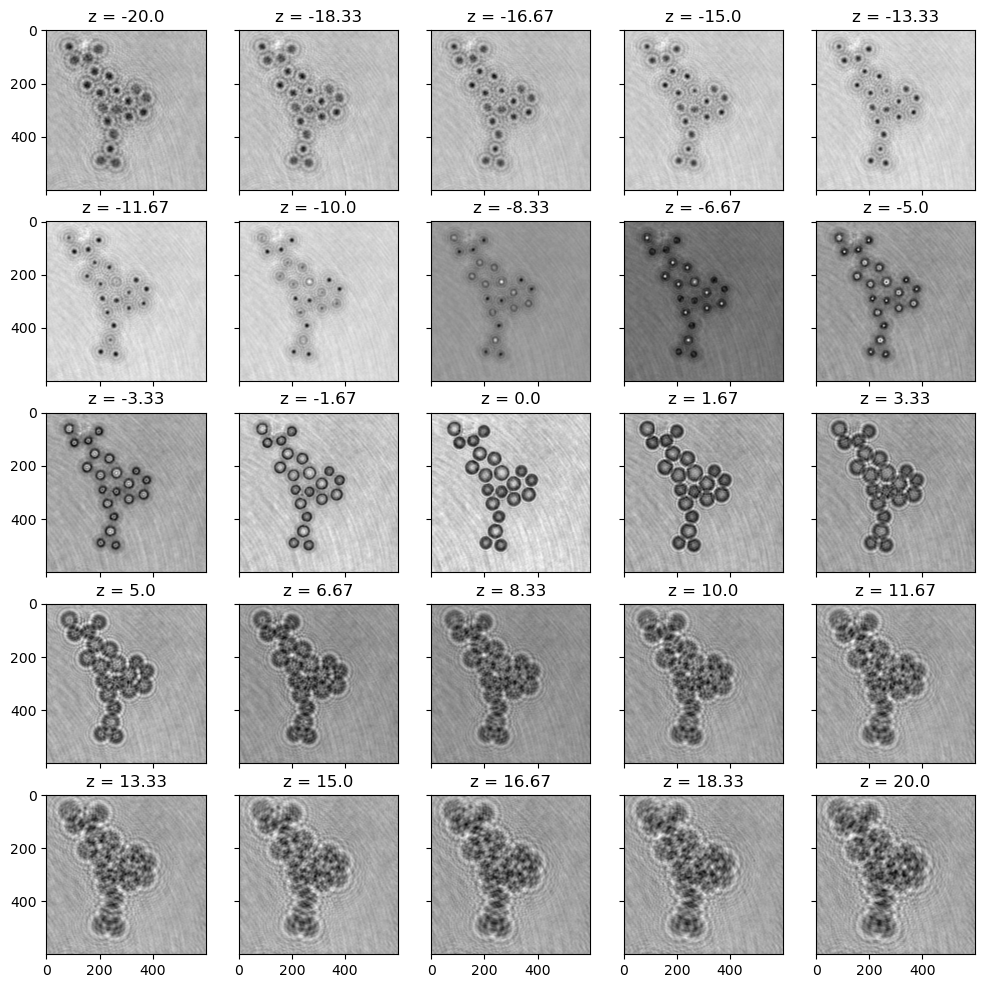

# off-axis-holography-python

## Description

Simple example of holographic reconstruction of an image aquired via off-axis-holography and also how to propagate the field

## Dependencies
numpy
matplotlib
scikit-image
scipy

## Examples
### Holographic reconstruction

Start from a holographic image and go to the full optical field.

🠳🠳🠳🠳🠳🠳🠳🠳🠳🠳🠳🠳🠳🠳🠳🠳🠳🠳🠳🠳🠳🠳🠳🠳🠳🠳🠳🠳🠳🠳🠳🠳🠳🠳🠳🠳🠳🠳🠳🠳🠳🠳🠳🠳🠳🠳🠳🠳🠳🠳🠳🠳🠳🠳🠳🠳🠳🠳🠳🠳🠳🠳🠳🠳🠳🠳🠳🠳🠳🠳🠳🠳🠳🠳🠳🠳🠳🠳🠳🠳🠳🠳🠳🠳🠳🠳🠳🠳

### Holographic reconstruction

From the optical field one can also propagate the field to any z.

